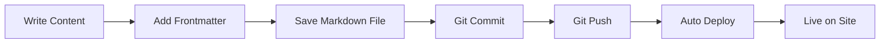
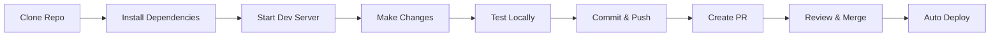
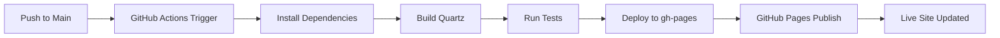

# CRPG.info Documentation

Complete documentation for the crpg.info GitHub Pages site built with Quartz.

## Overview

This documentation covers everything you need to know about managing, developing, and deploying the crpg.info website. Whether you're a content creator, developer, or site administrator, you'll find detailed guides for your needs.

### What is This Project?

**CRPG.info** is a static website dedicated to classic and modern Computer Role-Playing Games, built with:
- **Quartz v4** - A modern static site generator
- **GitHub Pages** - Free, reliable hosting
- **Markdown** - Easy-to-write content format
- **GitHub Actions** - Automated deployment pipeline

### Key Features

- Fast, static site with modern features
- Version control for all content
- Easy content updates via Markdown
- Automatic deployment on push
- Built-in search functionality
- Interactive graph view of content
- Mobile-responsive design
- Dark mode support
- Free hosting on GitHub Pages

---

## Documentation Index

### For Content Creators

#### [User Guide](USER_GUIDE.md)
**Complete guide for content creators and editors**

Learn how to:
- Add new articles and reviews
- Format content with Markdown
- Add images and media
- Create internal links
- Use tags and categories
- Publish your changes

**Start here if you're**: Adding or editing content

---

### For Developers

#### [Developer Guide](DEVELOPER_GUIDE.md)
**Complete guide for developers working on the site**

Learn how to:
- Set up local development environment
- Run Quartz locally
- Customize themes and styling
- Create custom components
- Add new features
- Troubleshoot common issues

**Start here if you're**: Building features or customizing the site

---

### For Administrators

#### [Deployment Guide](DEPLOYMENT_GUIDE.md)
**Complete guide for site deployment and maintenance**

Learn how to:
- Configure GitHub Pages
- Set up GitHub Actions workflows
- Configure custom domain
- Enable SSL/HTTPS
- Monitor deployments
- Rollback changes

**Start here if you're**: Managing deployment or infrastructure

---

### For Project Context

#### [Migration Notes](MIGRATION_NOTES.md)
**Documentation of the migration from original site to Quartz**

Learn about:
- Migration strategy and decisions
- Content conversion process
- Asset management approach
- URL structure and redirects
- Known limitations
- Future improvement plans

**Start here if you're**: Understanding project history or planning similar migrations

---

### Quick Access

#### [Quick Reference](QUICK_REFERENCE.md)
**Cheat sheet for common tasks and commands**

Quick access to:
- Essential commands
- Markdown syntax
- Git workflows
- Common tasks
- Troubleshooting fixes
- Useful links

**Start here if you're**: Looking for quick answers or command reference

---

## Getting Started

### I Want to Add Content

1. Read the [User Guide](USER_GUIDE.md)
2. Create a new Markdown file in `quartz/content/`
3. Add frontmatter and content
4. Commit and push to GitHub
5. Site automatically updates

**Quick example:**
```bash
# Create new review
cat > quartz/content/reviews/game-name.md << 'EOF'
---
title: "Game Name Review"
tags: [reviews]
date: 2025-10-24
---

# Game Name Review

Your content here...
EOF

# Commit and push
git add quartz/content/reviews/game-name.md
git commit -m "Add game review"
git push origin main
```

### I Want to Develop Locally

1. Read the [Developer Guide](DEVELOPER_GUIDE.md)
2. Install Node.js (v22+)
3. Clone repository
4. Install dependencies: `npm install`
5. Start dev server: `npx quartz build --serve`
6. Open `http://localhost:8080`

**Quick start:**
```bash
cd /home/user/Quartz/quartz
npm install
npx quartz build --serve
```

### I Want to Deploy Changes

1. Read the [Deployment Guide](DEPLOYMENT_GUIDE.md)
2. Make your changes
3. Push to `main` branch
4. GitHub Actions automatically builds and deploys
5. Site updates in 2-5 minutes

**Deployment is automatic** when you push to the main branch.

---

## Project Structure

```
Quartz/
├── quartz/                          # Main Quartz installation
│   ├── content/                     # 📝 YOUR CONTENT GOES HERE
│   │   ├── index.md                # Homepage
│   │   ├── assets/                 # Images, PDFs, files
│   │   └── crpg/                   # Main content
│   │       ├── reviews/            # Game reviews
│   │       ├── guides/             # Tutorials and guides
│   │       └── news/               # News articles
│   ├── quartz/                      # Quartz source code
│   │   ├── components/             # React components
│   │   ├── plugins/                # Content processors
│   │   └── styles/                 # CSS styling
│   ├── static/                      # Static files (favicon, CNAME)
│   ├── .github/workflows/          # GitHub Actions
│   ├── quartz.config.ts            # ⚙️ Main configuration
│   ├── quartz.layout.ts            # 📐 Layout configuration
│   └── package.json                # Dependencies
├── docs/                            # 📚 THIS DOCUMENTATION
│   ├── USER_GUIDE.md
│   ├── DEVELOPER_GUIDE.md
│   ├── DEPLOYMENT_GUIDE.md
│   ├── MIGRATION_NOTES.md
│   ├── QUICK_REFERENCE.md
│   └── README.md (you are here)
└── scrape_crpg.py                  # Content migration script
```

---

## Common Tasks

### Add a New Page

```bash
# 1. Create file
touch quartz/content/reviews/new-game.md

# 2. Add frontmatter and content
# (See User Guide for details)

# 3. Commit and push
git add quartz/content/reviews/new-game.md
git commit -m "Add new game review"
git push origin main
```

See: [User Guide - Adding New Content](USER_GUIDE.md#adding-new-content)

### Customize Theme

```typescript
// Edit quartz/quartz.config.ts
theme: {
  colors: {
    lightMode: {
      secondary: "#3b82f6",  // Link color
      tertiary: "#10b981",   // Accent color
    }
  }
}
```

See: [Developer Guide - Theme Customization](DEVELOPER_GUIDE.md#theme-customization)

### Deploy to Production

```bash
# Automatic: Just push to main
git push origin main

# Manual: Trigger workflow in GitHub Actions UI
```

See: [Deployment Guide - Deployment Process](DEPLOYMENT_GUIDE.md#deployment-process)

### Rollback Changes

```bash
# Find commit to revert to
git log --oneline

# Reset and force push
git reset --hard <commit-hash>
git push --force origin main
```

See: [Deployment Guide - Rollback Procedures](DEPLOYMENT_GUIDE.md#rollback-procedures)

---

## Key Concepts

### Markdown Content

All content is written in Markdown with YAML frontmatter:

```markdown
---
title: "Page Title"
tags: [tag1, tag2]
date: 2025-10-24
---

# Page Heading

Your content in **Markdown** format.
```

See: [User Guide - Markdown Formatting](USER_GUIDE.md#markdown-formatting)

### Quartz Configuration

Two main configuration files:

1. **quartz.config.ts** - Site settings, plugins, theme
2. **quartz.layout.ts** - Page layout and components

See: [Developer Guide - Configuration](DEVELOPER_GUIDE.md#configuration)

### Automatic Deployment

GitHub Actions workflow triggers on push to `main`:

```
Push to main → GitHub Actions → Build Quartz → Deploy to GitHub Pages → Live
```

See: [Deployment Guide - GitHub Actions Workflow](DEPLOYMENT_GUIDE.md#github-actions-workflow)

### Content Organization

Content organized in folders with frontmatter tags:

```
content/
├── reviews/        # Game reviews
├── guides/         # How-to guides
└── news/          # News articles
```

See: [User Guide - Content Organization](USER_GUIDE.md#content-organization)

---

## Troubleshooting

### Build Fails

```bash
# Clear cache and rebuild
rm -rf public/ .quartz-cache/ node_modules/
npm install
npx quartz build
```

See: [Developer Guide - Troubleshooting](DEVELOPER_GUIDE.md#troubleshooting)

### Links Not Working

Check link format:
- ✅ Use: `[[page-name]]`
- ❌ Avoid: `[page](page.md)`

See: [User Guide - Creating Links](USER_GUIDE.md#creating-links-between-pages)

### Site Not Updating

1. Check GitHub Actions completed successfully
2. Hard refresh browser (Ctrl+Shift+R)
3. Check DNS cache if using custom domain

See: [Deployment Guide - Troubleshooting](DEPLOYMENT_GUIDE.md#troubleshooting-deployments)

### Need More Help?

Check the [Quick Reference](QUICK_REFERENCE.md) for common issues and fixes.

---

## Technology Stack

### Core Technologies

| Technology | Purpose | Version |
|------------|---------|---------|
| Quartz | Static site generator | v4.5.2 |
| Node.js | JavaScript runtime | v22+ |
| TypeScript | Type-safe JavaScript | v5.9+ |
| GitHub Pages | Hosting | - |
| GitHub Actions | CI/CD | - |

### Key Libraries

- **Preact** - React alternative for components
- **Unified** - Content processing pipeline
- **Remark** - Markdown processing
- **Rehype** - HTML processing
- **FlexSearch** - Client-side search
- **D3** - Graph visualization

See: [Developer Guide - Project Structure](DEVELOPER_GUIDE.md#project-structure)

---

## Workflow Examples

### Content Creator Workflow



**Steps:**
1. Create/edit Markdown file
2. Add frontmatter metadata
3. Commit to git
4. Push to GitHub
5. Automatic deployment
6. Live in 2-5 minutes

### Developer Workflow



**Steps:**
1. Clone repository
2. Install dependencies
3. Start local server
4. Make changes
5. Test locally
6. Commit and push
7. Create pull request
8. Review and merge
9. Automatic deployment

### Deployment Workflow



**Steps:**
1. Push to main branch
2. GitHub Actions triggers
3. Dependencies installed
4. Quartz builds site
5. Tests run (if configured)
6. Deploys to gh-pages branch
7. GitHub Pages publishes
8. Site updated

---

## Best Practices

### Content

- Use descriptive filenames
- Add comprehensive frontmatter
- Include alt text for images
- Link to related content
- Use consistent tag names
- Keep content organized in folders

See: [User Guide - Best Practices](USER_GUIDE.md#tips-and-best-practices)

### Development

- Test locally before pushing
- Use feature branches for major changes
- Follow TypeScript best practices
- Keep dependencies updated
- Document custom components
- Use semantic commit messages

See: [Developer Guide - Development Workflow](DEVELOPER_GUIDE.md#development-workflow)

### Deployment

- Monitor build status
- Test in staging first
- Keep rollback plan ready
- Monitor analytics
- Check for broken links
- Review performance metrics

See: [Deployment Guide - Best Practices](DEPLOYMENT_GUIDE.md#best-practices)

---

## Contributing

### How to Contribute

1. Fork the repository
2. Create feature branch
3. Make your changes
4. Test locally
5. Commit with clear messages
6. Push to your fork
7. Create pull request

### Contribution Guidelines

- **Content**: Follow User Guide formatting
- **Code**: Follow TypeScript/Prettier standards
- **Commits**: Use conventional commit format
- **PRs**: Include description and testing notes

### Content Contributions

Anyone can contribute content via pull requests:

1. Add new Markdown file
2. Include proper frontmatter
3. Use appropriate tags
4. Add relevant images (optimized)
5. Test links work
6. Submit PR with description

---

## Resources

### Documentation

- [User Guide](USER_GUIDE.md) - Content creation
- [Developer Guide](DEVELOPER_GUIDE.md) - Development
- [Deployment Guide](DEPLOYMENT_GUIDE.md) - Deployment
- [Migration Notes](MIGRATION_NOTES.md) - Project history
- [Quick Reference](QUICK_REFERENCE.md) - Quick lookup

### External Links

- [Quartz Documentation](https://quartz.jzhao.xyz)
- [Quartz GitHub](https://github.com/jackyzha0/quartz)
- [GitHub Pages Docs](https://docs.github.com/en/pages)
- [Markdown Guide](https://www.markdownguide.org)
- [Obsidian Help](https://help.obsidian.md)

### Tools

- [GitHub CLI](https://cli.github.com)
- [Obsidian](https://obsidian.md)
- [VS Code](https://code.visualstudio.com)
- [Node.js](https://nodejs.org)

---

## Project Information

### Repository

- **GitHub**: `https://github.com/username/crpg-info`
- **Live Site**: `https://crpg.info`
- **Status**: Active development

### License

[Specify license - MIT, CC, etc.]

### Version

- **Quartz Version**: 4.5.2
- **Documentation Version**: 1.0.0
- **Last Updated**: 2025-10-24

### Maintainers

[List project maintainers and contact information]

---

## Frequently Asked Questions

### How do I add a new page?

Create a Markdown file in `quartz/content/`, add frontmatter, and push to GitHub. See [User Guide - Adding New Content](USER_GUIDE.md#adding-new-content).

### How long does deployment take?

Typically 2-5 minutes after pushing to main. Check GitHub Actions for status.

### Can I preview changes before publishing?

Yes! Run `npx quartz build --serve` locally. See [Developer Guide - Running Locally](DEVELOPER_GUIDE.md#running-quartz-locally).

### How do I add images?

Place images in `content/assets/images/` and reference with ``. See [User Guide - Images](USER_GUIDE.md#working-with-images-and-assets).

### What if deployment fails?

Check GitHub Actions logs for errors. Common issues: syntax errors, missing dependencies, or configuration issues. See [Deployment Guide - Troubleshooting](DEPLOYMENT_GUIDE.md#troubleshooting-deployments).

### Can I use my own domain?

Yes! Configure DNS records and add CNAME file. See [Deployment Guide - Domain Configuration](DEPLOYMENT_GUIDE.md#domain-configuration).

### How do I rollback a bad deployment?

Reset git to previous commit and force push. See [Deployment Guide - Rollback Procedures](DEPLOYMENT_GUIDE.md#rollback-procedures).

### Where do I report issues?

Create a GitHub issue with details about the problem.

---

## Next Steps

### New to the Project?

1. Read [User Guide](USER_GUIDE.md) if creating content
2. Read [Developer Guide](DEVELOPER_GUIDE.md) if developing
3. Bookmark [Quick Reference](QUICK_REFERENCE.md) for quick access

### Ready to Contribute?

1. Fork the repository
2. Set up local environment
3. Make your changes
4. Submit a pull request

### Need Help?

- Check documentation first
- Review [Quick Reference](QUICK_REFERENCE.md)
- Check existing GitHub issues
- Create new issue if needed

---

## Documentation Changelog

### Version 1.0.0 (2025-10-24)

- Initial documentation release
- Complete User Guide
- Complete Developer Guide
- Complete Deployment Guide
- Migration Notes
- Quick Reference

### Future Documentation Plans

- Video tutorials
- Interactive examples
- Advanced customization guides
- Performance optimization guide
- SEO best practices guide

---

**Welcome to CRPG.info!**

Whether you're here to add content, develop features, or manage deployment, this documentation has you covered. Start with the guide that matches your role, and don't hesitate to explore the others to get a complete understanding of the project.

Happy documenting!

---

**Documentation maintained by**: Agent 4 - Documentation Agent
**Last updated**: 2025-10-24
**Version**: 1.0.0
